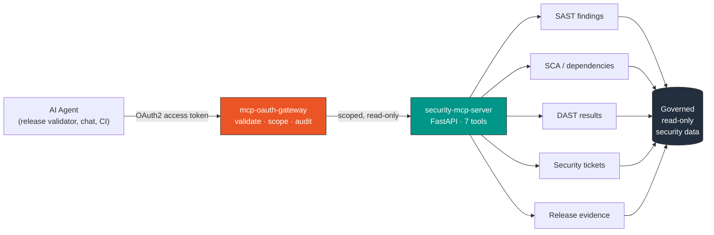

<!--
  ⚙️  BEFORE YOU PUSH — replace these placeholders:
      BLOG FEED          → in .github/workflows/blog-post-workflow.yml, set feed_list to your real RSS
                           (dev.to / Medium / personal blog). Until then the Latest Posts section stays empty.
      Repo links under "Currently Building" assume repos named exactly as shown — rename if needed.
-->

# Hi, I'm Nitiraj 👋

**Product Security Engineer** building **agentic security automation** — secure-by-default MCP data layers and evidence-driven release gates for AI agents.

📍 Pune, India · Open to **Product Security / DevSecOps / AI Platform** roles

---

### 🔐 How I work

Least-privilege by default, evidence over opinion, and automation that makes the secure path the easy path. I turn security review from a manual gate into a self-service, agent-driven capability — without leaking credentials or handing agents more access than they need.

---

### 🚀 Currently Building

> Public, clean-room reimplementations of production patterns — no proprietary code.

| Project | What it is |
| --- | --- |
| 🤖 [**security-mcp-server**](https://github.com/nitiraj195/security-mcp-server) | FastAPI MCP server exposing read-only security data (SAST / SCA / DAST / tickets) to AI agents, OAuth-gated |
| ✅ [**sdlc-security-validator**](https://github.com/nitiraj195/sdlc-security-validator) | Agentic release-readiness pipeline (Evidence → Analysis → Reporting) producing GO / CONDITIONAL / NO-GO scorecards |
| ☸️ [**k8s-security-service-toolkit**](https://github.com/nitiraj195/k8s-security-service-toolkit) | AppSec microservices on Kubernetes: runbooks, CronJobs, secrets visibility |
| 🔐 [**mcp-oauth-gateway**](https://github.com/nitiraj195/mcp-oauth-gateway) | Reusable pattern for authenticating AI agents to sensitive data without leaking credentials |

---

### 🧭 How the MCP security layer fits together

*Agents never hold data-source credentials — the gateway brokers scoped, auditable, read-only access.*

---

### 🏆 Highlights

- 🤖 Delivered an **agentic AppSec release-readiness validator** (Google ADK) — **~80% reduction** in release-verification time, adopted by **10 product teams**
- 🔐 Built and productionized an **OAuth-gated MCP Security Server** (FastAPI) exposing 7 governed, read-only security tools to AI agents
- ♻️ Established a **reusable MCP pattern** that reduces credential exposure in consuming agents
- ☸️ Deployed AppSec ETL / ticketing microservices to **Kubernetes**; authored operational runbooks; resolved a production namespace-deletion outage
- 🖥️ 10+ years in DevOps / Platform: managed **2500+ AWS instances**, led **GKE upgrades** and **HA drills**, built self-service infra tooling
- 🚀 **CNCF Kubestronaut** — all 5 Kubernetes certifications cleared
- 🥇 Recognized with **AI Kudos** (Jan 2026) and **Ownership** (Oct 2025) awards

---

### 🛠️ Tech Stack

| Area | Stack |
| --- | --- |
| **AI / Agentic** | MCP · Google ADK · FastAPI |
| **Security** | DevSecOps · OAuth · SAST / SCA / DAST |
| **Cloud & Platform** | AWS · GCP · Kubernetes · Helm |
| **IaC & CI/CD** | Terraform · GitLab CI · Jenkins · Docker |
| **Data & Observability** | Snowflake · Prometheus · Grafana · Streamlit |
| **Languages** | Python · Bash |

---

### 📜 Certifications

**☸️ Kubernetes — [CNCF Kubestronaut](https://www.credly.com/badges/bcfccd71-5588-4920-9bd4-e4a385a15304)** (all 5)

- [Certified Kubernetes Security Specialist (CKS)](https://www.credly.com/badges/281d372d-0e84-40e4-be6e-26f108d2c62e)
- [Certified Kubernetes Administrator (CKA)](https://www.credly.com/badges/37a0ead4-189f-48a3-a673-b85597f37d32)
- [Certified Kubernetes Application Developer (CKAD)](https://www.credly.com/badges/d6baa2f2-fa37-4efd-9db1-277c5373901b)
- [Kubernetes and Cloud Native Security Associate (KCSA)](https://www.credly.com/badges/b5cdfec7-cadb-4ff5-bf25-4f324aeb1578)
- [Kubernetes and Cloud Native Associate (KCNA)](https://www.credly.com/badges/d382a870-a76f-423d-9787-7c66a8bdc0c0)

**☁️ AWS**

- [AWS Certified Security – Specialty](https://www.credly.com/badges/ecfe59c0-24f5-499a-abea-c4f1639f57a7)
- [AWS Certified AI Practitioner](https://www.credly.com/badges/7c167ccc-57e1-4a5a-b6a2-b130fbfaa245)

**🏗️ HashiCorp**

- HashiCorp Terraform Associate

---

### ✍️ Latest Posts

<!-- Auto-updated by .github/workflows/blog-post-workflow.yml — set your feed there. -->
<!-- BLOG-POST-LIST:START -->
<!-- BLOG-POST-LIST:END -->

---

### 📊 GitHub Stats

 
 

---

### 🐍 Contribution graph

<!-- Powered by the .github/workflows/snake.yml action in this repo. It writes to the `output` branch. -->
<picture>
  <source media="(prefers-color-scheme: dark)" srcset="https://raw.githubusercontent.com/nitiraj195/nitiraj195/output/github-snake-dark.svg" />
  
</picture>

---

💬 Let's build secure, AI-native systems together — feel free to ⭐ my repos and reach out.
